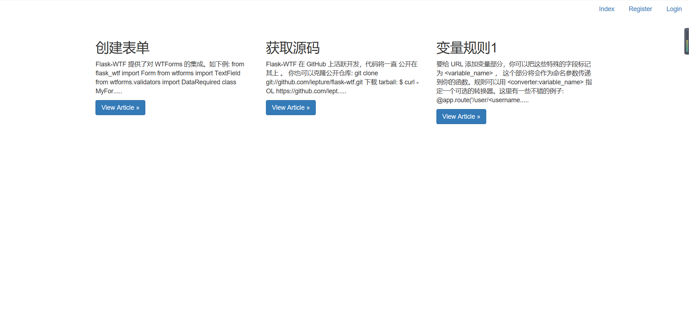
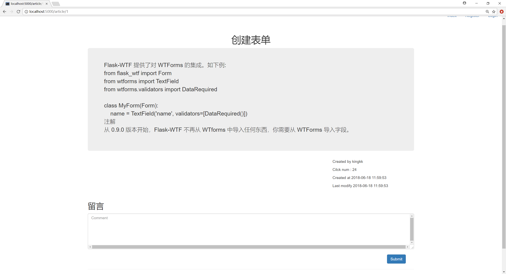
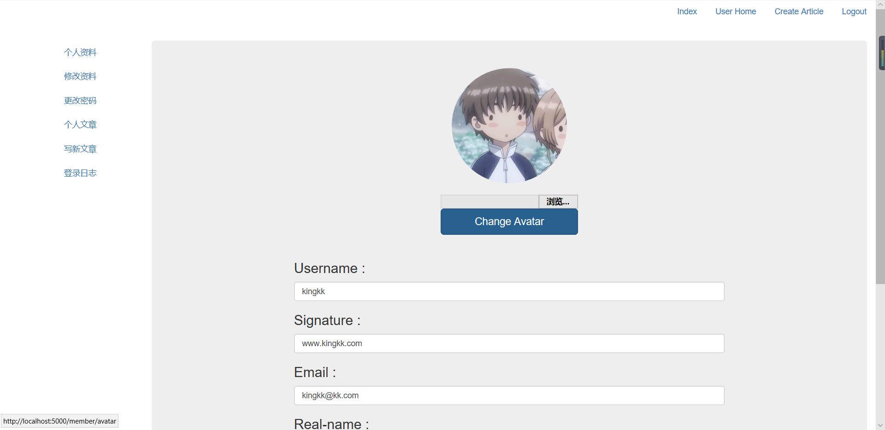
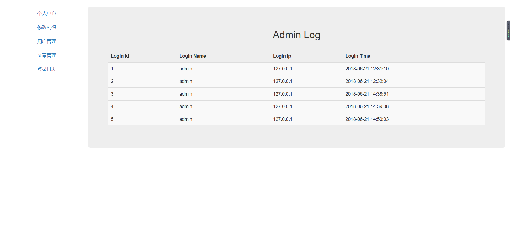
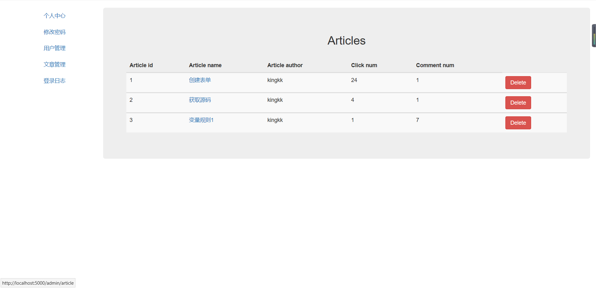

# Flask-blog
用flask+bootstrap写的博客系统
连接数据库和表单处理都是用flask自带的SQLAlchemy、wtforms

# 功能模块

## Admin

- index 展示个人信息
- login 登录
- adminlog 管理员的登录日志
- password 修改密码
- article 管理全部文章
- delete 删除文章
- user 用户管理

暂未开通管理员注册功能 
数据库设计时是区分了普通管理员和超级管理员，但是功能上还未做区分 
本来后台还可以写很多功能，但是很多是和member中几乎重复的功能，由于懒和感觉有些机械重复化，先暂时搁置

## Member

- index 展示个人信息
- register 注册
- login 登录
- lougout 注销
- update 修改文章
- comment 评论
- modify 修改个人资料
- password 修改个人密码
- articles 查看个人文章
- avatar 上传头像
- userlog 登录日志

member也就是用户模块，算是写的最多的一个模块
用户认证、权限管理、文件上传

## Blog

- index 主页
- article 文章详情

主要是做展示用的，功能较少

## 展示
主页

文章详情

个人后台

管理员后台

文章管理

# 目前已知的两个问题

## 存储型XSS
### 产生原因
由于没有富文本编辑器导致需要输出换行和空格符时有困难
然后输出时添加了safe标签，导致`<script>`标签也能原样输出 
### 预设解决方案
先转义一遍`<`、`>`,然后在对空格和回车进行转义
不过也感觉不太好，就暂时没管

##  任意url跳转
### 产生原因
页面登录后的跳转直接取自next参数，容易任意url跳转
### 预设解决方案
对url做匹配处理
不过危害不是很大，而且处理起来可能并不是很简单，也就先空着没管
